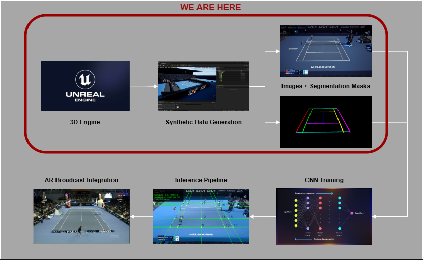
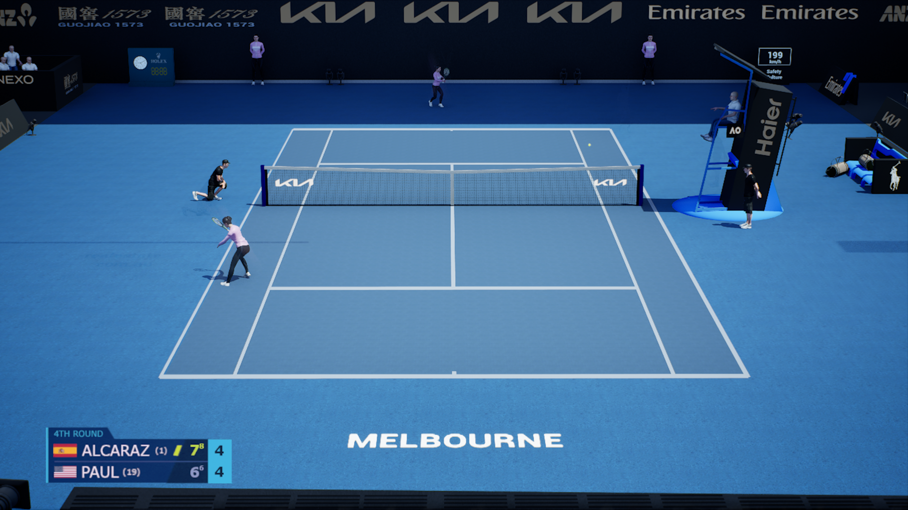
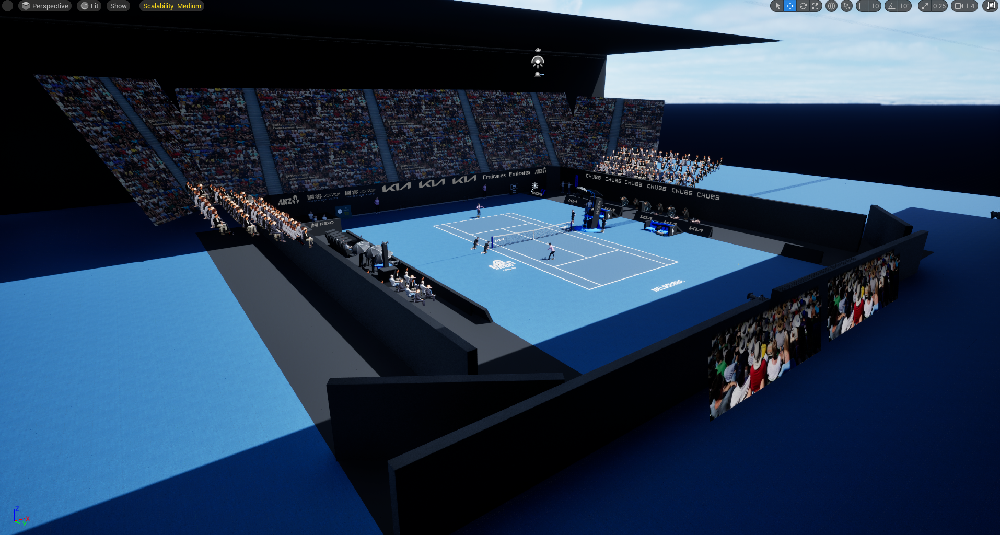
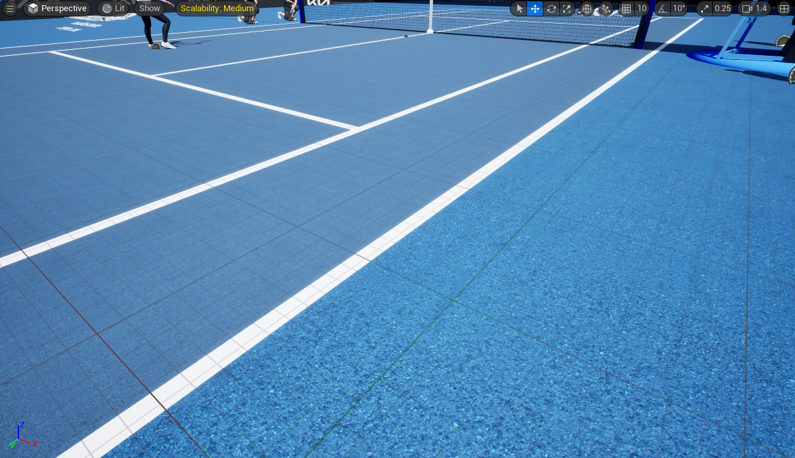
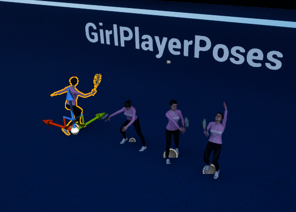
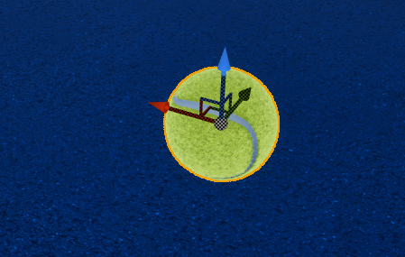
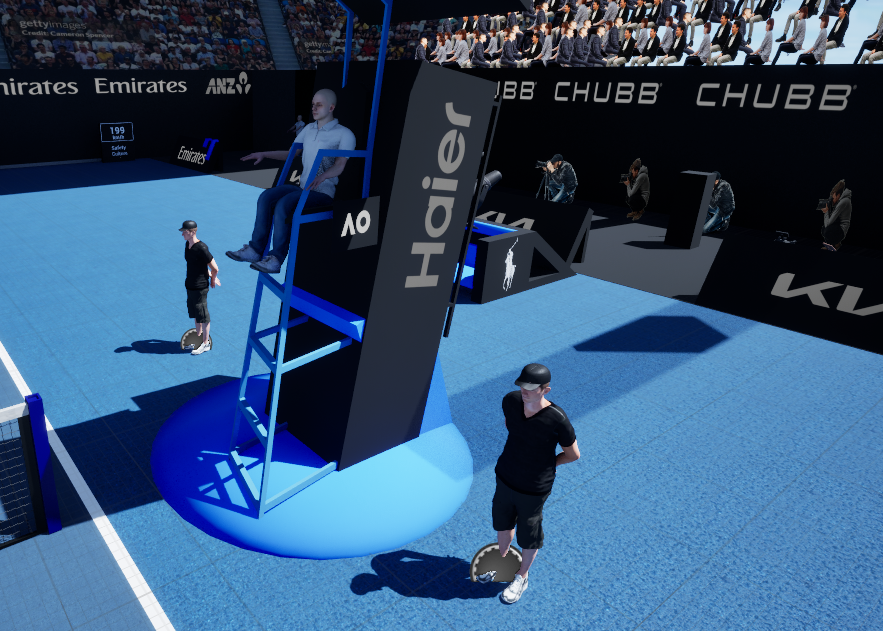
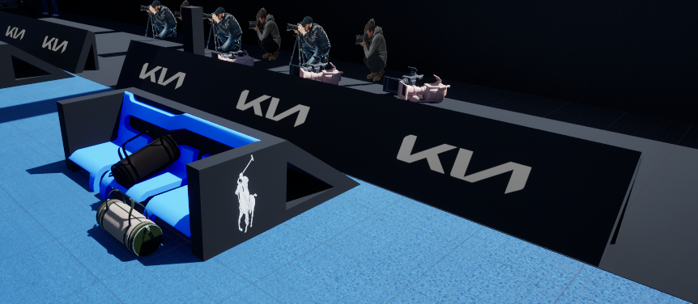
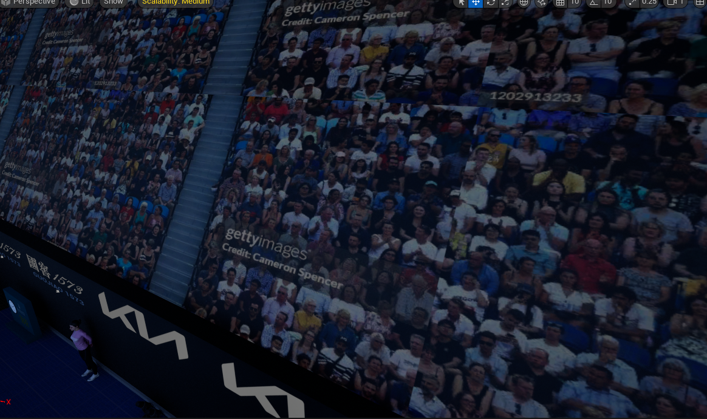

## Synthetic Data Generation Unreal Engine 5

Computer Vision systems rely heavily on large, high-quality annotated datasets. However, creating these datasets is often the most time-consuming and expensive part of the development process. Manual annotation is not only slow but also prone to inconsistencies, especially in tasks that require pixel-level precision such as semantic segmentation.

Synthetic data generation has emerged as a viable alternative to traditional data collection and labeling workflows. By leveraging 3D engines, it is possible to generate fully annotated datasets automatically, with perfect alignment between images and labels. This approach enables rapid dataset creation, full control over scene conditions, and eliminates human annotation errors.

In this project, Unreal Engine is used to generate a synthetic dataset for the segmentation of tennis court lines. The goal is to demonstrate that a model trained entirely on synthetic data can learn meaningful visual features and generalize to the target task without relying on manually labeled real-world data even if you are not a good artist to recreate this type of scenearios. Obviusly there a improvement at this part because i am a software engineer and this type of things are always the worst parts.

This module focuses specifically on the data generation pipeline: from scene creation and variation design to automated rendering and mask extraction.

  
  

---

### Technical Overview

This project is structured as an end-to-end pipeline that integrates synthetic data generation, deep learning, and real-time rendering.

At a high level, Unreal Engine is used to generate synthetic images of a tennis court along with perfectly aligned segmentation masks in a few seconds, what normally this type of actions will cost a lot of human hours manual annotation. These datasets are then used to train a neural network for line segmentation using PyTorch. The trained model is later integrated into an inference pipeline, where it is used to extract geometric information from images, enabling camera pose estimation and augmented reality overlays.

The purpose of this section is to provide a simplified view of how each component interacts within the system. The diagram below highlights the main stages of the pipeline and the flow of data between them.

  

---

### Why Unreal Engine?

Unreal Engine was selected as the core platform for synthetic data generation due to its ability to provide full control over the visual environment, combined with high-fidelity rendering and flexible automation capabilities.

Unlike traditional dataset creation workflows, which rely on manual annotation tools, a 3D engine enables direct access to scene-level information. This allows for automatic generation of perfectly aligned labels alongside rendered images, eliminating the need for post-processing or human intervention.

Compared to alternatives such as <u>[**Unity**](https://unity.com/es)</u> or <u>[**Blender**](https://www.blender.org/)</u>, [**Unreal Engine**](https://www.unrealengine.com/es-ES) offers a strong balance between visual realism and real-time performance. Its rendering system supports physically-based lighting, which is particularly useful for simulating diverse environmental conditions that improve model robustness.

Additionally, Unreal Engine provides multiple ways to automate data generation, including **Blueprints** and **C++**, making it suitable for building scalable data pipelines without requiring external tools.

From a practical perspective, prior experience with the engine also enabled faster development and iteration, which is a relevant factor in prototyping environments.

---

### Data Generation Strategy

The data generation strategy in this project is intentionally scoped to a controlled and well-defined scenario. Since this is a personal project aimed at validating the feasibility of synthetic data pipelines, the focus is not on building a fully generalized dataset, but rather on replicating a specific real-world setup with sufficient variability to enable model generalization within that context.

The reference scenario used is a broadcast view of a tennis match from the Australian Open, specifically a match between Carlos Alcaraz and Tommy Paul. The synthetic environment was designed to approximate this setup as closely as possible, including camera perspective, court layout, and overall visual composition.

Rather than attempting to cover all possible tennis environments, the approach consists of introducing controlled variability within this reference scenario. This includes modifications in camera positioning, lighting conditions, and scene elements, with the goal of ensuring that the model learns robust features while remaining aligned with the target domain.

This design choice reflects a trade-off between realism and scope. For a production-level system, the dataset would need to incorporate a much broader distribution of conditions, including:

- Different tournaments and court surfaces
- Variations in time of day and lighting
- Multiple camera configurations and broadcast styles
- Environmental factors such as weather and crowd presence
- Other Sports

However, for the purpose of this project, the objective is more focused: to demonstrate that a model trained purely on synthetic data can successfully segment the court lines in a specific real-world scenario that closely matches the generated data.

| Real Image Reference | Synthetic Image Unreal Engine |
|----------|----------|
|  |  |

---

### Synthetic Scene Design and Domain Randomization

**1. Overview**

This section describes how the synthetic tennis court environment was configured and how the data generation process was automated. The focus is on the factors that influence model generalization rather than on 3D asset creation, as the goal is to generate a dataset tailored to a specific scenario.

The reference scenario is a broadcast view of the Australian Open match between Carlos Alcaraz and Tommy Paul. The synthetic environment was designed to approximate this setup closely, including camera perspective, court layout, and overall visual composition.

  

**2. Scene Setup**

The tennis court was modeled based on official dimensions, with the origin (0,0,0) set at the center of the court. Key elements included:

    

- **Court lines**: defined with appropriate thickness and color, with slight variations introduced to simulate natural differences found in real broadcasts.
- **Players**: placed at randomized positions and poses within the court to reflect realistic variability.
- **Ball**: multiple positions and heights per scene to simulate dynamic play.
- **Other objects**: ball boys, umpire chair, and minor props to mimic the real environment.
- **Grandstands / audience**: generated using images of real crowds with tone adjustments to simulate depth and variation.

    
    
    
    
    
    

**3. Domain Randomization**

